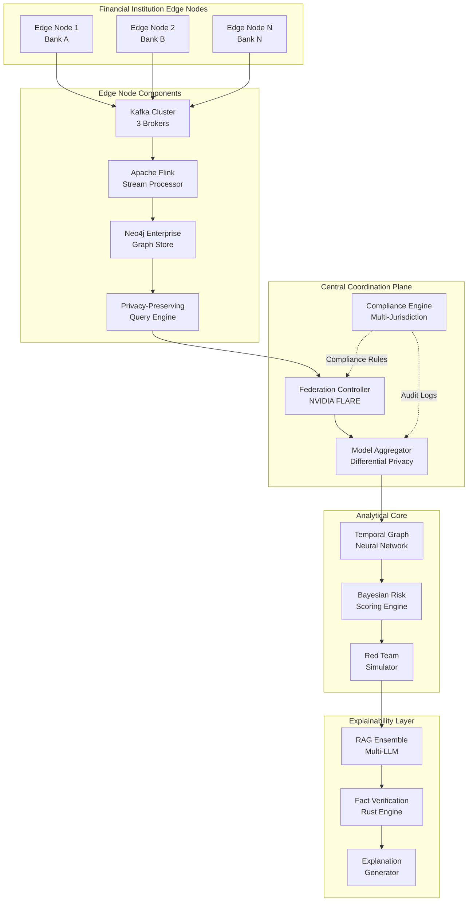
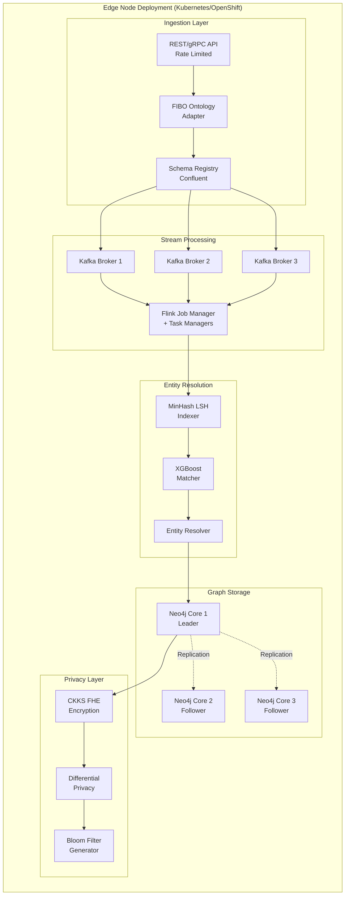
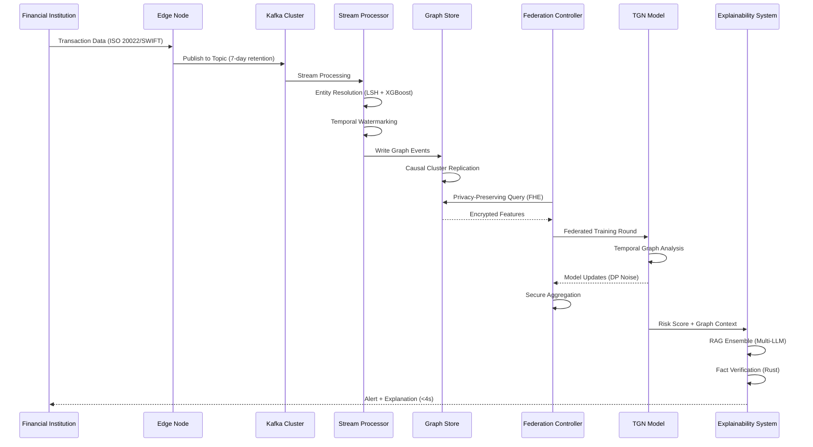

# Design Document: MuleNet 3.0 - Enterprise-Grade Cyber-Financial Mule Detection Platform

## Overview

MuleNet 3.0 is a production-ready, enterprise-grade platform designed to detect and prevent financial mule operations across distributed banking networks. The platform combines federated intelligence architecture with privacy-preserving computation, temporal graph analytics, and multi-jurisdictional regulatory compliance. It operates at scale (1.2B edges, 60K TPS ingestion) while maintaining strict privacy guarantees through homomorphic encryption and differential privacy mechanisms.

The system employs a zero-trust federated architecture where financial institutions maintain sovereignty over their data while contributing to collective intelligence. Core detection capabilities leverage Temporal Graph Neural Networks (TGN) with memory modules to identify complex mule patterns across time-evolving transaction networks. The platform achieves <2% false positive rates with 92%+ recall, generating human-readable explanations in <4 seconds through a RAG-based explainability system with zero-hallucination guarantees.

MuleNet 3.0 is designed for multi-jurisdictional compliance (GDPR, UK GDPR, DPDP Act 2023, GLBA, UK MLR 2017) and includes adversarial hardening through continuous red-team validation against 47+ evasion tactics.

## Architecture

### System-Level Architecture




### Federated Edge Node Architecture



### Data Flow Architecture




## Components and Interfaces

### Component 1: Federated Edge Node

**Purpose**: Autonomous data processing unit deployed at each financial institution, maintaining data sovereignty while enabling federated intelligence.

**Interface**:
```typescript
interface EdgeNode {
  // Data ingestion
  ingestTransaction(transaction: Transaction): Promise<IngestResult>
  validateSchema(data: unknown, schemaId: string): ValidationResult
  
  // Stream processing
  processStream(topic: string, processor: StreamProcessor): void
  applyWatermark(event: Event, timestamp: number): WatermarkedEvent
  
  // Entity resolution
  resolveEntity(entity: RawEntity): Promise<ResolvedEntity>
  matchEntities(entity1: Entity, entity2: Entity): MatchScore
  
  // Graph operations
  writeGraphEvent(event: GraphEvent): Promise<void>
  queryGraph(query: CypherQuery, encrypted: boolean): Promise<QueryResult>
  
  // Privacy operations
  encryptFeatures(features: Features): EncryptedFeatures
  applyDifferentialPrivacy(data: Data, epsilon: number): PrivateData
  generateBloomFilter(entities: Entity[]): BloomFilter
  
  // Federation
  participateInRound(roundId: string): Promise<ModelUpdate>
  receiveGlobalModel(model: GlobalModel): void
}
```

**Responsibilities**:
- Ingest and validate transaction data from multiple formats (ISO 20022, SWIFT MT103, STIX 2.1)
- Perform real-time stream processing with exactly-once semantics
- Resolve entity identities across heterogeneous data sources
- Maintain temporal graph database with causal consistency
- Apply privacy-preserving transformations before federation
- Participate in federated learning rounds with local model training

### Component 2: FIBO Ontology Canonical Adapter

**Purpose**: Transforms heterogeneous financial data formats into a unified FIBO-compliant ontology for consistent processing.

**Interface**:
```typescript
interface FIBOAdapter {
  // Format detection and parsing
  detectFormat(data: Buffer): DataFormat
  parseISO20022(xml: string): FIBOTransaction
  parseSWIFTMT103(swift: string): FIBOTransaction
  parseSTIX21(json: string): FIBOThreatIntel
  
  // Ontology mapping
  mapToFIBO(source: RawData, format: DataFormat): FIBOEntity
  validateOntology(entity: FIBOEntity): ValidationResult
  
  // Schema evolution
  registerSchema(schema: Schema, version: string): void
  migrateSchema(data: Data, fromVersion: string, toVersion: string): Data
}
```

**Responsibilities**:
- Auto-detect incoming data formats
- Parse and validate multiple financial messaging standards
- Map source data to FIBO ontology concepts
- Handle schema evolution and backward compatibility
- Ensure semantic consistency across data sources

### Component 3: Temporal Graph Neural Network (TGN)

**Purpose**: Core detection engine using temporal graph neural networks with memory modules to identify mule patterns across time-evolving transaction networks.

**Interface**:
```typescript
interface TemporalGraphNN {
  // Model operations
  initialize(config: TGNConfig): void
  train(graphSnapshot: TemporalGraph, labels: Labels): TrainingMetrics
  predict(graphSnapshot: TemporalGraph): Predictions
  
  // Memory module
  updateMemory(nodeId: string, interaction: Interaction): void
  queryMemory(nodeId: string, timestamp: number): MemoryState
  
  // Temporal operations
  computeTemporalEmbedding(node: Node, timeWindow: TimeWindow): Embedding
  aggregateNeighbors(node: Node, timestamp: number): AggregatedFeatures
  
  // Federated learning
  getLocalModelUpdate(): ModelUpdate
  applyGlobalModelUpdate(update: GlobalModelUpdate): void
  
  // Adversarial hardening
  evaluateAgainstAttack(attack: AdversarialAttack): RobustnessMetrics
}
```

**Responsibilities**:
- Learn temporal patterns in transaction graphs
- Maintain memory state for nodes across time
- Generate node embeddings capturing temporal context
- Support federated training with differential privacy
- Resist adversarial evasion attempts

### Component 4: Bayesian Risk Scoring Engine

**Purpose**: Converts TGN predictions into calibrated risk scores with uncertainty quantification and cost-optimized alerting thresholds.

**Interface**:
```typescript
interface BayesianRiskScorer {
  // Risk scoring
  computeRiskScore(prediction: Prediction, context: Context): RiskScore
  calibrateScore(rawScore: number, historicalData: Data): CalibratedScore
  
  // Uncertainty quantification
  computeUncertainty(prediction: Prediction): UncertaintyMetrics
  estimatePosterior(prior: Distribution, evidence: Evidence): Distribution
  
  // Threshold optimization
  optimizeThresholds(costMatrix: CostMatrix, data: Data): Thresholds
  assignAlertTier(score: RiskScore, thresholds: Thresholds): AlertTier
  
  // Cost-benefit analysis
  computeExpectedCost(score: RiskScore, action: Action): number
  recommendAction(score: RiskScore, costs: CostMatrix): Action
}
```

**Responsibilities**:
- Transform model predictions into interpretable risk scores
- Provide uncertainty estimates for risk assessments
- Optimize alert thresholds based on cost matrices
- Assign four-tier alert levels (Informational, Monitoring, Investigation, Critical)
- Support cost-benefit decision making


### Component 5: Privacy-Preserving Query Engine

**Purpose**: Enables cross-institution intelligence sharing while maintaining data privacy through homomorphic encryption and secure multi-party computation.

**Interface**:
```typescript
interface PrivacyPreservingQueryEngine {
  // Homomorphic encryption (CKKS)
  encryptQuery(query: Query, publicKey: PublicKey): EncryptedQuery
  executeEncrypted(query: EncryptedQuery, data: Data): EncryptedResult
  decryptResult(result: EncryptedResult, privateKey: PrivateKey): Result
  
  // Differential privacy
  addNoise(data: Data, epsilon: number, delta: number): PrivateData
  computePrivacyBudget(queries: Query[]): PrivacyBudget
  
  // Secure aggregation
  createSecretShares(value: number, parties: number): Share[]
  aggregateShares(shares: Share[]): number
  
  // Bloom filter operations
  createBloomFilter(entities: Entity[], falsePositiveRate: number): BloomFilter
  queryBloomFilter(filter: BloomFilter, entity: Entity): boolean
  intersectFilters(filters: BloomFilter[]): BloomFilter
}
```

**Responsibilities**:
- Execute queries on encrypted data without decryption
- Apply differential privacy guarantees to query results
- Coordinate secure multi-party computation protocols
- Generate and query privacy-preserving Bloom filters
- Track and enforce privacy budget constraints

### Component 6: RAG Ensemble Explainability System

**Purpose**: Generates human-readable explanations for risk scores using retrieval-augmented generation with multi-LLM providers and zero-hallucination guarantees.

**Interface**:
```typescript
interface RAGExplainabilitySystem {
  // Explanation generation
  generateExplanation(
    riskScore: RiskScore,
    graphContext: GraphContext,
    regulatoryContext: RegulatoryContext
  ): Promise<Explanation>
  
  // Multi-LLM ensemble
  queryLLM(prompt: string, provider: LLMProvider): Promise<LLMResponse>
  ensembleResponses(responses: LLMResponse[]): EnsembledResponse
  
  // Retrieval
  retrieveRelevantContext(query: Query, topK: number): Context[]
  rankContextByRelevance(contexts: Context[], query: Query): RankedContext[]
  
  // Fact verification
  verifyFacts(explanation: Explanation, groundTruth: GroundTruth): VerificationResult
  groundToFacts(text: string, facts: Fact[]): GroundedText
  
  // Regulatory compliance
  formatForJurisdiction(explanation: Explanation, jurisdiction: Jurisdiction): FormattedExplanation
  includeRegulatoryReferences(explanation: Explanation): ExplanationWithCitations
}
```

**Responsibilities**:
- Generate explanations in <4 seconds
- Query multiple LLM providers (GPT-4, Gemini, Claude) and ensemble results
- Retrieve relevant context from knowledge base
- Verify all facts against ground truth using Rust verification engine
- Ensure zero hallucinations through fact grounding
- Format explanations for specific regulatory jurisdictions

### Component 7: Multi-Jurisdictional Compliance Engine

**Purpose**: Ensures platform operations comply with multiple regulatory frameworks across jurisdictions (GDPR, UK GDPR, DPDP Act 2023, GLBA, UK MLR 2017).

**Interface**:
```typescript
interface ComplianceEngine {
  // Regulatory rule management
  loadRegulatoryFramework(jurisdiction: Jurisdiction): RegulatoryRules
  validateOperation(operation: Operation, rules: RegulatoryRules): ComplianceResult
  
  // Data governance
  enforceDataRetention(data: Data, jurisdiction: Jurisdiction): void
  handleDataSubjectRequest(request: DSR, type: DSRType): DSRResponse
  
  // Audit logging
  logOperation(operation: Operation, metadata: AuditMetadata): void
  generateAuditReport(timeRange: TimeRange, jurisdiction: Jurisdiction): AuditReport
  
  // Consent management
  recordConsent(subject: DataSubject, purpose: Purpose): void
  validateConsent(subject: DataSubject, operation: Operation): boolean
  
  // Cross-border transfer
  validateTransfer(data: Data, fromJurisdiction: Jurisdiction, toJurisdiction: Jurisdiction): TransferValidation
  applyAdequacyDecision(transfer: Transfer): boolean
}
```

**Responsibilities**:
- Load and interpret regulatory rules for multiple jurisdictions
- Validate all operations against applicable regulations
- Enforce data retention and deletion policies
- Handle data subject rights requests (access, rectification, erasure, portability)
- Maintain comprehensive audit logs
- Manage consent and lawful basis for processing
- Validate cross-border data transfers

### Component 8: Adversarial Red Team Simulator

**Purpose**: Continuously tests detection capabilities against 47+ evasion tactics to ensure adversarial robustness.

**Interface**:
```typescript
interface RedTeamSimulator {
  // Attack simulation
  simulateAttack(attack: AttackTTP, targetGraph: Graph): AttackResult
  generateAdversarialExamples(basePattern: Pattern, perturbations: number): Example[]
  
  // Evasion tactics
  applyStructuralEvasion(graph: Graph, tactic: StructuralTactic): ModifiedGraph
  applyTemporalEvasion(transactions: Transaction[], tactic: TemporalTactic): Transaction[]
  applyVolumeEvasion(amounts: number[], tactic: VolumeTactic): number[]
  
  // Robustness testing
  measureDetectionRate(attacks: Attack[], model: Model): DetectionMetrics
  identifyBlindSpots(model: Model, attackSpace: AttackSpace): BlindSpot[]
  
  // Continuous validation
  scheduleRedTeamExercise(frequency: Duration): void
  reportVulnerabilities(results: TestResults): VulnerabilityReport
}
```

**Responsibilities**:
- Simulate 47+ mule evasion tactics
- Generate adversarial examples for model testing
- Apply structural, temporal, and volume-based evasions
- Measure detection rates against adversarial attacks
- Identify model blind spots and vulnerabilities
- Schedule continuous red team exercises
- Report vulnerabilities for remediation


## Data Models

### Transaction

```typescript
interface Transaction {
  // Core identifiers
  transactionId: string
  timestamp: number  // Unix timestamp in milliseconds
  
  // Parties
  sender: Entity
  receiver: Entity
  intermediaries: Entity[]
  
  // Financial details
  amount: number
  currency: string  // ISO 4217 code
  transactionType: TransactionType
  
  // Metadata
  sourceFormat: DataFormat  // ISO20022 | SWIFT_MT103 | STIX21
  fiboMapped: boolean
  schemaVersion: string
  
  // Risk indicators
  riskFlags: RiskFlag[]
  anomalyScore?: number
}

enum TransactionType {
  WIRE_TRANSFER = "WIRE_TRANSFER",
  ACH = "ACH",
  CARD_PAYMENT = "CARD_PAYMENT",
  CRYPTO_TRANSFER = "CRYPTO_TRANSFER",
  CASH_DEPOSIT = "CASH_DEPOSIT",
  CASH_WITHDRAWAL = "CASH_WITHDRAWAL"
}

enum DataFormat {
  ISO20022 = "ISO20022",
  SWIFT_MT103 = "SWIFT_MT103",
  STIX21 = "STIX21",
  INTERNAL = "INTERNAL"
}
```

**Validation Rules**:
- transactionId must be unique across the system
- timestamp must be within valid range (not future, not older than retention period)
- amount must be positive
- currency must be valid ISO 4217 code
- sender and receiver must be resolved entities
- sourceFormat must match actual data structure

### Entity

```typescript
interface Entity {
  // Identity
  entityId: string  // Globally unique after resolution
  entityType: EntityType
  
  // Identifiers (pre-resolution)
  rawIdentifiers: Identifier[]
  
  // Resolved attributes
  name?: string
  dateOfBirth?: string
  address?: Address
  phoneNumbers: string[]
  emailAddresses: string[]
  
  // Financial attributes
  accountNumbers: string[]
  bankIdentifiers: BankIdentifier[]
  
  // Graph attributes
  firstSeen: number
  lastSeen: number
  transactionCount: number
  totalVolume: number
  
  // Risk attributes
  riskScore?: number
  watchlistMatches: WatchlistMatch[]
  pepStatus: boolean
  sanctionStatus: boolean
  
  // Privacy
  encryptedAttributes?: EncryptedData
  bloomFilterHash?: string
}

enum EntityType {
  INDIVIDUAL = "INDIVIDUAL",
  BUSINESS = "BUSINESS",
  ACCOUNT = "ACCOUNT",
  DEVICE = "DEVICE",
  IP_ADDRESS = "IP_ADDRESS",
  CRYPTO_WALLET = "CRYPTO_WALLET"
}

interface Identifier {
  type: IdentifierType
  value: string
  confidence: number  // 0.0 to 1.0
}

enum IdentifierType {
  SSN = "SSN",
  PASSPORT = "PASSPORT",
  DRIVERS_LICENSE = "DRIVERS_LICENSE",
  TAX_ID = "TAX_ID",
  ACCOUNT_NUMBER = "ACCOUNT_NUMBER",
  IBAN = "IBAN",
  SWIFT_BIC = "SWIFT_BIC",
  EMAIL = "EMAIL",
  PHONE = "PHONE",
  DEVICE_ID = "DEVICE_ID",
  IP_ADDRESS = "IP_ADDRESS",
  CRYPTO_ADDRESS = "CRYPTO_ADDRESS"
}
```

**Validation Rules**:
- entityId must be unique after entity resolution
- entityType must be specified
- At least one identifier must be present
- Confidence scores must be between 0.0 and 1.0
- firstSeen must be <= lastSeen
- transactionCount and totalVolume must be non-negative
- PII fields must be encrypted when transmitted across edge nodes

### TemporalGraph

```typescript
interface TemporalGraph {
  // Graph structure
  nodes: Map<string, Node>
  edges: Map<string, Edge>
  
  // Temporal properties
  timeWindow: TimeWindow
  snapshotTimestamp: number
  
  // Metadata
  graphId: string
  edgeNodeId: string
  version: number
}

interface Node {
  nodeId: string
  entityId: string
  nodeType: EntityType
  
  // Features
  staticFeatures: Features
  temporalFeatures: TemporalFeatures
  
  // Memory state (for TGN)
  memoryState?: MemoryState
  lastUpdated: number
  
  // Graph metrics
  degree: number
  inDegree: number
  outDegree: number
  clusteringCoefficient: number
  pageRank?: number
}

interface Edge {
  edgeId: string
  sourceNodeId: string
  targetNodeId: string
  
  // Temporal properties
  timestamp: number
  duration?: number
  
  // Transaction properties
  transactionId: string
  amount: number
  currency: string
  
  // Features
  edgeFeatures: Features
  
  // Graph metrics
  weight: number
  betweennessCentrality?: number
}

interface TimeWindow {
  startTime: number
  endTime: number
  windowSize: number  // in milliseconds
}
```

**Validation Rules**:
- All node and edge IDs must be unique within the graph
- Edge source and target must reference existing nodes
- Edge timestamp must be within the graph's time window
- Memory state must be updated when new interactions occur
- Graph metrics must be recomputed when structure changes


### RiskScore

```typescript
interface RiskScore {
  // Core score
  score: number  // 0.0 to 1.0
  tier: AlertTier
  
  // Uncertainty quantification
  confidence: number  // 0.0 to 1.0
  uncertaintyMetrics: UncertaintyMetrics
  
  // Contributing factors
  factors: RiskFactor[]
  graphContext: GraphContext
  
  // Temporal context
  timestamp: number
  historicalScores: HistoricalScore[]
  
  // Metadata
  modelVersion: string
  computationTime: number  // milliseconds
}

enum AlertTier {
  INFORMATIONAL = "INFORMATIONAL",  // Score 0.0-0.3
  MONITORING = "MONITORING",        // Score 0.3-0.6
  INVESTIGATION = "INVESTIGATION",  // Score 0.6-0.85
  CRITICAL = "CRITICAL"             // Score 0.85-1.0
}

interface UncertaintyMetrics {
  variance: number
  credibleInterval: [number, number]  // 95% credible interval
  epistemic: number  // Model uncertainty
  aleatoric: number  // Data uncertainty
}

interface RiskFactor {
  factorType: RiskFactorType
  contribution: number  // -1.0 to 1.0
  description: string
  evidence: Evidence[]
}

enum RiskFactorType {
  VELOCITY_ANOMALY = "VELOCITY_ANOMALY",
  STRUCTURAL_PATTERN = "STRUCTURAL_PATTERN",
  TEMPORAL_PATTERN = "TEMPORAL_PATTERN",
  ENTITY_RISK = "ENTITY_RISK",
  NETWORK_CENTRALITY = "NETWORK_CENTRALITY",
  CROSS_BORDER = "CROSS_BORDER",
  ROUND_AMOUNT = "ROUND_AMOUNT",
  RAPID_MOVEMENT = "RAPID_MOVEMENT",
  LAYERING = "LAYERING",
  SMURFING = "SMURFING"
}

interface GraphContext {
  subgraph: TemporalGraph
  relevantPaths: Path[]
  communityMembership: string[]
  temporalMotifs: Motif[]
}
```

**Validation Rules**:
- score must be between 0.0 and 1.0
- confidence must be between 0.0 and 1.0
- tier must match score range
- factor contributions must sum to approximately 1.0
- credibleInterval must be valid [lower, upper] with lower < upper
- computationTime must be positive

### FederatedModelUpdate

```typescript
interface FederatedModelUpdate {
  // Round information
  roundId: string
  roundNumber: number
  timestamp: number
  
  // Model update
  modelDelta: ModelWeights
  gradients?: Gradients
  
  // Privacy guarantees
  differentialPrivacy: DPParameters
  encryptionScheme: EncryptionScheme
  
  // Metadata
  edgeNodeId: string
  trainingMetrics: TrainingMetrics
  datasetSize: number  // Number of samples used
  
  // Validation
  signature: string
  checksum: string
}

interface ModelWeights {
  layers: Map<string, Tensor>
  version: string
  architecture: string
}

interface DPParameters {
  epsilon: number
  delta: number
  noiseMultiplier: number
  clippingNorm: number
}

enum EncryptionScheme {
  CKKS_FHE = "CKKS_FHE",
  PAILLIER = "PAILLIER",
  SECURE_AGGREGATION = "SECURE_AGGREGATION"
}

interface TrainingMetrics {
  loss: number
  accuracy: number
  precision: number
  recall: number
  f1Score: number
  auc: number
  
  // Convergence metrics
  gradientNorm: number
  parameterNorm: number
  
  // Computational metrics
  trainingTime: number  // milliseconds
  memoryUsage: number   // bytes
}
```

**Validation Rules**:
- roundNumber must be sequential
- epsilon and delta must satisfy privacy budget constraints
- modelDelta must match expected architecture
- signature must be valid for the edge node
- checksum must match computed hash of model weights
- trainingMetrics must be within expected ranges

### Explanation

```typescript
interface Explanation {
  // Core explanation
  explanationId: string
  riskScoreId: string
  text: string
  
  // Structure
  summary: string
  detailedAnalysis: string
  keyFindings: Finding[]
  
  // Evidence
  supportingEvidence: Evidence[]
  graphVisualizations: Visualization[]
  
  // Regulatory compliance
  jurisdiction: Jurisdiction
  regulatoryCitations: Citation[]
  legalBasis: string
  
  // Fact verification
  verificationStatus: VerificationStatus
  verifiedFacts: Fact[]
  confidenceScore: number
  
  // Multi-LLM ensemble
  llmProviders: LLMProvider[]
  ensembleAgreement: number  // 0.0 to 1.0
  
  // Metadata
  generationTime: number  // milliseconds
  timestamp: number
  version: string
}

interface Finding {
  findingType: FindingType
  severity: Severity
  description: string
  evidence: Evidence[]
  recommendation?: string
}

enum FindingType {
  MULE_PATTERN = "MULE_PATTERN",
  VELOCITY_ANOMALY = "VELOCITY_ANOMALY",
  STRUCTURAL_ANOMALY = "STRUCTURAL_ANOMALY",
  ENTITY_RISK = "ENTITY_RISK",
  REGULATORY_CONCERN = "REGULATORY_CONCERN"
}

enum Severity {
  LOW = "LOW",
  MEDIUM = "MEDIUM",
  HIGH = "HIGH",
  CRITICAL = "CRITICAL"
}

interface Evidence {
  evidenceType: EvidenceType
  description: string
  data: any
  confidence: number
  source: string
}

enum EvidenceType {
  TRANSACTION_PATTERN = "TRANSACTION_PATTERN",
  GRAPH_STRUCTURE = "GRAPH_STRUCTURE",
  TEMPORAL_SEQUENCE = "TEMPORAL_SEQUENCE",
  ENTITY_ATTRIBUTE = "ENTITY_ATTRIBUTE",
  EXTERNAL_DATA = "EXTERNAL_DATA"
}

enum VerificationStatus {
  VERIFIED = "VERIFIED",
  PARTIALLY_VERIFIED = "PARTIALLY_VERIFIED",
  UNVERIFIED = "UNVERIFIED",
  FAILED = "FAILED"
}

enum LLMProvider {
  GPT4 = "GPT4",
  GEMINI = "GEMINI",
  CLAUDE = "CLAUDE"
}

enum Jurisdiction {
  EU_GDPR = "EU_GDPR",
  UK_GDPR = "UK_GDPR",
  UK_MLR_2017 = "UK_MLR_2017",
  INDIA_DPDP_2023 = "INDIA_DPDP_2023",
  US_GLBA = "US_GLBA",
  US_BSA = "US_BSA"
}
```

**Validation Rules**:
- text must be non-empty and human-readable
- generationTime must be < 4000 milliseconds (4 seconds)
- verificationStatus must be VERIFIED for production alerts
- All facts must be grounded in evidence
- ensembleAgreement must be > 0.7 for high-confidence explanations
- regulatoryCitations must be valid for the specified jurisdiction
- confidenceScore must be between 0.0 and 1.0


## Correctness Properties

### Property 1: Data Sovereignty
For all edge nodes E and all data D processed by E, D never leaves E's jurisdiction without explicit consent and privacy-preserving transformation.

```
∀ edge_node ∈ EdgeNodes, ∀ data ∈ edge_node.data:
  (data.transmitted_externally = true) ⟹ 
    (data.consent_obtained = true ∧ 
     (data.encrypted = true ∨ data.anonymized = true ∨ data.aggregated = true))
```

### Property 2: Privacy Budget Enforcement
The cumulative privacy loss across all queries must never exceed the configured privacy budget (ε, δ).

```
∀ edge_node ∈ EdgeNodes:
  Σ(query.epsilon for query in edge_node.queries) ≤ edge_node.privacy_budget.epsilon ∧
  Σ(query.delta for query in edge_node.queries) ≤ edge_node.privacy_budget.delta
```

### Property 3: Temporal Consistency
For any temporal graph snapshot, all edges must have timestamps within the snapshot's time window, and node memory states must reflect all interactions up to the snapshot time.

```
∀ graph ∈ TemporalGraphs, ∀ edge ∈ graph.edges:
  graph.timeWindow.startTime ≤ edge.timestamp ≤ graph.timeWindow.endTime ∧
  ∀ node ∈ graph.nodes:
    node.memoryState.lastUpdated ≤ graph.snapshotTimestamp ∧
    node.memoryState reflects all interactions where interaction.timestamp ≤ graph.snapshotTimestamp
```

### Property 4: Entity Resolution Consistency
Once two entities are resolved as the same, all their historical and future transactions must be attributed to the unified entity.

```
∀ entity1, entity2 ∈ Entities:
  (resolved(entity1, entity2) = true) ⟹
    ∀ transaction ∈ Transactions:
      (transaction.involves(entity1) ∨ transaction.involves(entity2)) ⟹
        transaction.attributed_to(unified_entity(entity1, entity2))
```

### Property 5: Alert Tier Consistency
Risk scores must map to alert tiers according to defined thresholds, and tier assignments must be monotonic with respect to score.

```
∀ riskScore ∈ RiskScores:
  (0.0 ≤ riskScore.score < 0.3) ⟹ riskScore.tier = INFORMATIONAL ∧
  (0.3 ≤ riskScore.score < 0.6) ⟹ riskScore.tier = MONITORING ∧
  (0.6 ≤ riskScore.score < 0.85) ⟹ riskScore.tier = INVESTIGATION ∧
  (0.85 ≤ riskScore.score ≤ 1.0) ⟹ riskScore.tier = CRITICAL ∧
  ∀ score1, score2: (score1 < score2) ⟹ tier_level(score1.tier) ≤ tier_level(score2.tier)
```

### Property 6: Explanation Latency Guarantee
All explanations must be generated within 4 seconds of risk score computation.

```
∀ explanation ∈ Explanations:
  explanation.generationTime < 4000 milliseconds
```

### Property 7: Zero-Hallucination Guarantee
All facts in explanations must be verifiable against ground truth data, and unverified facts must not appear in production explanations.

```
∀ explanation ∈ ProductionExplanations, ∀ fact ∈ explanation.facts:
  ∃ evidence ∈ GroundTruth: verifies(evidence, fact) = true ∧
  explanation.verificationStatus = VERIFIED
```

### Property 8: Federated Model Convergence
After sufficient training rounds, the global model must converge to a state where validation loss decreases and detection metrics improve.

```
∀ training_session ∈ TrainingSessions:
  ∃ round_n: ∀ round_m where m > n:
    global_model(round_m).validation_loss < global_model(round_m-1).validation_loss ∨
    global_model(round_m).detection_metrics ≥ global_model(round_m-1).detection_metrics
```

### Property 9: Differential Privacy Guarantee
Model updates must satisfy (ε, δ)-differential privacy, ensuring that the presence or absence of any single training example has bounded impact on the model.

```
∀ model_update ∈ ModelUpdates, ∀ dataset1, dataset2 where differ_by_one(dataset1, dataset2):
  ∀ output ∈ PossibleOutputs:
    P(model_update(dataset1) = output) ≤ e^ε × P(model_update(dataset2) = output) + δ
```

### Property 10: Causal Consistency in Graph Replication
In Neo4j causal clusters, if a write W1 happens before write W2 on the leader, then all followers must observe W1 before W2.

```
∀ write1, write2 ∈ GraphWrites:
  (write1.timestamp < write2.timestamp ∧ write1.leader = write2.leader) ⟹
    ∀ follower ∈ Followers:
      follower.observes(write1) happens_before follower.observes(write2)
```

### Property 11: Adversarial Robustness
The detection model must maintain minimum performance thresholds even under adversarial attacks from the red team simulator.

```
∀ attack ∈ AdversarialAttacks:
  detection_rate(model, attack) ≥ minimum_detection_threshold ∧
  false_positive_rate(model, attack) ≤ maximum_false_positive_threshold
where:
  minimum_detection_threshold = 0.85
  maximum_false_positive_threshold = 0.05
```

### Property 12: Regulatory Compliance
All operations must comply with applicable regulations for the relevant jurisdiction, and audit logs must be maintained for the required retention period.

```
∀ operation ∈ Operations, ∀ jurisdiction ∈ ApplicableJurisdictions(operation):
  complies_with(operation, regulations(jurisdiction)) = true ∧
  ∃ audit_log: records(audit_log, operation) ∧
    audit_log.retention_period ≥ required_retention(jurisdiction)
```


## Error Handling

### Error Scenario 1: Schema Validation Failure

**Condition**: Incoming transaction data fails schema validation against the registered schema version.

**Response**: 
- Reject the transaction with HTTP 400 Bad Request
- Log validation errors with full context (schema version, validation failures, data sample)
- Increment schema_validation_failure metric
- Send alert to data quality monitoring system

**Recovery**:
- If schema version mismatch detected, attempt automatic schema migration
- If migration fails, route to dead letter queue for manual review
- Notify data provider of schema issues with specific error details
- Continue processing other valid transactions

### Error Scenario 2: Entity Resolution Ambiguity

**Condition**: Entity resolution produces multiple high-confidence matches (confidence > 0.8) for the same raw entity.

**Response**:
- Create provisional entity with ambiguity flag
- Store all candidate matches with confidence scores
- Route to human review queue for disambiguation
- Continue processing with provisional entity

**Recovery**:
- Human reviewer selects correct entity or creates new entity
- System retroactively updates all transactions with resolved entity
- Recompute affected graph metrics and risk scores
- Update entity resolution model with feedback

### Error Scenario 3: Privacy Budget Exhaustion

**Condition**: Cumulative privacy loss (ε) approaches or exceeds configured budget.

**Response**:
- Reject new queries with HTTP 429 Too Many Requests
- Log privacy budget status and requesting party
- Send alert to privacy officer
- Return error with budget reset time

**Recovery**:
- Wait for privacy budget reset period (typically 24 hours)
- Alternatively, increase privacy budget if justified and approved
- Implement query batching to reduce privacy cost
- Review query patterns to optimize privacy budget usage

### Error Scenario 4: Neo4j Cluster Split-Brain

**Condition**: Network partition causes Neo4j causal cluster to have multiple leaders.

**Response**:
- Detect split-brain through leader election monitoring
- Immediately halt writes to prevent inconsistency
- Alert operations team with CRITICAL priority
- Activate read-only mode for queries

**Recovery**:
- Resolve network partition
- Force leader election to establish single leader
- Reconcile any conflicting writes using timestamp ordering
- Verify causal consistency before resuming writes
- Run integrity checks on graph data

### Error Scenario 5: TGN Memory State Corruption

**Condition**: Node memory state becomes inconsistent with interaction history (checksum mismatch).

**Response**:
- Mark affected node memory as corrupted
- Quarantine node from model predictions
- Log corruption details (node ID, last valid state, corruption timestamp)
- Increment memory_corruption_error metric

**Recovery**:
- Rebuild memory state from interaction history
- Replay all interactions in temporal order
- Verify reconstructed state with checksums
- Resume normal processing once verified
- Investigate root cause (hardware error, software bug, adversarial attack)

### Error Scenario 6: Federated Aggregation Failure

**Condition**: Insufficient edge nodes participate in federated learning round (< minimum threshold).

**Response**:
- Abort current training round
- Log participating and non-participating nodes
- Send notifications to non-responsive edge nodes
- Increment aggregation_failure metric

**Recovery**:
- Investigate connectivity issues with non-participating nodes
- Retry round after connectivity restored
- If persistent failures, adjust minimum participation threshold
- Consider asynchronous federated learning for unreliable nodes

### Error Scenario 7: Explanation Generation Timeout

**Condition**: RAG ensemble fails to generate explanation within 4-second SLA.

**Response**:
- Return partial explanation with timeout indicator
- Log timeout details (LLM provider latencies, retrieval time, verification time)
- Increment explanation_timeout metric
- Queue for asynchronous completion

**Recovery**:
- Complete explanation generation asynchronously
- Update explanation once available
- Notify analyst of explanation availability
- Analyze timeout cause (slow LLM, large context, verification bottleneck)
- Optimize slow components (caching, model selection, context pruning)

### Error Scenario 8: Homomorphic Encryption Failure

**Condition**: CKKS encryption/decryption fails due to parameter mismatch or corruption.

**Response**:
- Reject encrypted query with HTTP 500 Internal Server Error
- Log encryption parameters and error details
- Alert security team
- Increment encryption_failure metric

**Recovery**:
- Verify encryption parameters match between parties
- Regenerate keys if corruption detected
- Re-establish secure channel
- Retry query with corrected parameters
- Investigate potential security incident

### Error Scenario 9: Regulatory Compliance Violation

**Condition**: Operation violates regulatory rule for applicable jurisdiction (e.g., data retention exceeded, consent missing).

**Response**:
- Immediately halt violating operation
- Log violation details with full audit trail
- Alert compliance officer with CRITICAL priority
- Quarantine affected data

**Recovery**:
- Remediate violation (delete data, obtain consent, etc.)
- Document remediation actions in audit log
- Report to regulatory authority if required
- Update compliance rules to prevent recurrence
- Conduct root cause analysis

### Error Scenario 10: Adversarial Attack Detection

**Condition**: Red team simulator or runtime monitoring detects successful evasion attack.

**Response**:
- Log attack details (TTP used, success rate, affected patterns)
- Increment adversarial_attack_detected metric
- Alert security team
- Activate enhanced monitoring for similar patterns

**Recovery**:
- Analyze attack to understand evasion mechanism
- Retrain model with adversarial examples
- Update detection rules to cover evasion tactic
- Deploy updated model to all edge nodes
- Conduct red team validation of fix


## Testing Strategy

### Unit Testing Approach

Each component will have comprehensive unit tests covering:

**FIBO Adapter**:
- Format detection accuracy for ISO 20022, SWIFT MT103, STIX 2.1
- Parsing correctness for each format
- Ontology mapping validation
- Schema evolution and migration
- Error handling for malformed data

**Entity Resolution**:
- MinHash LSH indexing correctness
- XGBoost matcher accuracy on labeled dataset
- Confidence score calibration
- Handling of ambiguous matches
- Performance on large entity sets

**Stream Processing**:
- Exactly-once semantics verification
- Watermark propagation correctness
- Late event handling
- Backpressure management
- State recovery after failure

**Graph Operations**:
- Cypher query correctness
- Causal consistency in replication
- Transaction isolation levels
- Index performance
- Concurrent write handling

**Privacy Operations**:
- CKKS encryption/decryption correctness
- Differential privacy noise calibration
- Privacy budget tracking accuracy
- Bloom filter false positive rate
- Secure aggregation protocol correctness

**Coverage Goals**: 90%+ line coverage, 85%+ branch coverage

### Property-Based Testing Approach

Property-based tests will validate invariants across random inputs using fast-check (TypeScript) and Hypothesis (Python).

**Property Test Library**: fast-check for TypeScript components, Hypothesis for Python components

**Key Properties to Test**:

1. **Entity Resolution Transitivity**:
   - If entity A resolves to B, and B resolves to C, then A must resolve to C
   - Property: `∀ a, b, c: resolve(a, b) ∧ resolve(b, c) ⟹ resolve(a, c)`

2. **Privacy Budget Monotonicity**:
   - Privacy budget consumption must be monotonically increasing
   - Property: `∀ queries q1...qn: budget_after(q1...qi) ≤ budget_after(q1...qi+1)`

3. **Temporal Graph Consistency**:
   - Adding edges in any order must produce same final graph structure
   - Property: `∀ edge_sequences s1, s2 where set(s1) = set(s2): graph(s1) ≡ graph(s2)`

4. **Risk Score Monotonicity**:
   - Adding suspicious features must not decrease risk score
   - Property: `∀ features f, suspicious_feature s: score(f ∪ {s}) ≥ score(f)`

5. **Differential Privacy Composition**:
   - Sequential queries must satisfy privacy composition theorem
   - Property: `∀ queries q1...qn with (ε1, δ1)...(εn, δn): total_privacy ≤ (Σεi, Σδi)`

6. **Encryption Homomorphism**:
   - Encrypted operations must preserve algebraic properties
   - Property: `∀ a, b: decrypt(encrypt(a) + encrypt(b)) = a + b`

7. **Explanation Factuality**:
   - All generated facts must be verifiable against ground truth
   - Property: `∀ explanation e, fact f ∈ e.facts: ∃ evidence ∈ ground_truth: verifies(evidence, f)`

8. **Graph Replication Convergence**:
   - All replicas must eventually converge to same state
   - Property: `∀ replicas r1, r2: eventually(r1.state = r2.state)`

### Integration Testing Approach

Integration tests will validate component interactions and end-to-end workflows:

**Data Ingestion Pipeline**:
- End-to-end flow from raw transaction to graph storage
- Schema registry integration
- Kafka producer/consumer interaction
- Flink job execution and state management

**Federated Learning Round**:
- Complete federated training round across multiple edge nodes
- Model aggregation with differential privacy
- Global model distribution
- Convergence validation

**Detection and Explanation**:
- Transaction ingestion → graph update → TGN prediction → risk scoring → explanation generation
- Latency validation (<4s for explanation)
- Accuracy validation against labeled test set

**Privacy-Preserving Queries**:
- Encrypted query execution across edge nodes
- Bloom filter intersection
- Privacy budget enforcement
- Result decryption and validation

**Compliance Workflows**:
- Data subject rights request handling
- Audit log generation and retrieval
- Cross-border transfer validation
- Consent management

**Adversarial Testing**:
- Red team attack simulation
- Detection rate measurement
- Model robustness validation
- Evasion tactic coverage

**Test Environments**:
- Local: Docker Compose with all components
- Staging: Kubernetes cluster with 3 edge nodes
- Production-like: Full-scale deployment with realistic data volumes

**Performance Testing**:
- Load testing: 60K TPS sustained ingestion
- Stress testing: 100K TPS burst handling
- Scalability testing: 1.2B edges in graph
- Latency testing: P50, P95, P99 for all operations


## Performance Considerations

### Scalability Targets

**Transaction Ingestion**:
- Sustained throughput: 60,000 TPS per edge node
- Burst capacity: 100,000 TPS for 5 minutes
- Ingestion latency: P95 < 100ms, P99 < 500ms

**Graph Storage**:
- Maximum graph size: 1.2 billion edges
- Maximum nodes: 500 million entities
- Query latency: P95 < 200ms for simple queries, P95 < 2s for complex traversals

**Model Inference**:
- TGN prediction latency: P95 < 500ms
- Batch prediction throughput: 10,000 predictions/second
- Memory footprint: < 32GB per edge node

**Explanation Generation**:
- End-to-end latency: P95 < 4s (SLA requirement)
- Concurrent explanations: 100 simultaneous requests
- LLM query latency: P95 < 2s per provider

### Optimization Strategies

**Data Ingestion**:
- Kafka partitioning by entity hash for parallelism
- Flink operator chaining to reduce serialization overhead
- Async I/O for external lookups (watchlists, sanctions)
- Batching for Neo4j writes (1000 transactions per batch)

**Graph Operations**:
- Composite indexes on (entity_id, timestamp) for temporal queries
- Materialized views for frequently accessed subgraphs
- Query result caching with 5-minute TTL
- Read replicas for query load distribution

**Model Training**:
- Mixed precision training (FP16) to reduce memory and increase throughput
- Gradient accumulation for large effective batch sizes
- Model parallelism for large TGN architectures
- Asynchronous federated learning to tolerate slow nodes

**Privacy Operations**:
- Batched homomorphic operations to amortize encryption overhead
- Precomputed Bloom filters refreshed every 15 minutes
- Differential privacy noise pregeneration
- Secure aggregation with efficient secret sharing

**Explanation Generation**:
- LLM response caching for similar contexts (cache hit rate target: 40%)
- Parallel LLM queries to multiple providers
- Context pruning to reduce token count
- Fact verification result caching

### Resource Allocation

**Per Edge Node (Kubernetes)**:
- Kafka: 3 brokers × (8 CPU, 32GB RAM, 2TB SSD)
- Flink: 1 JobManager (4 CPU, 16GB RAM) + 8 TaskManagers (8 CPU, 32GB RAM each)
- Neo4j: 3 cores × (16 CPU, 64GB RAM, 4TB NVMe SSD)
- Privacy Engine: 4 CPU, 16GB RAM, GPU optional for FHE acceleration
- Total per edge node: ~100 CPU cores, 400GB RAM, 20TB storage

**Central Coordination**:
- Federation Controller: 8 CPU, 32GB RAM
- Model Aggregator: 16 CPU, 64GB RAM, 4× NVIDIA A100 GPUs
- Compliance Engine: 4 CPU, 16GB RAM
- RAG Explainability: 32 CPU, 128GB RAM, 2× NVIDIA A100 GPUs

### Monitoring and Observability

**Key Metrics**:
- Ingestion rate (TPS), latency (P50/P95/P99)
- Graph size (nodes, edges), query latency
- Model performance (precision, recall, F1, AUC)
- Privacy budget consumption rate
- Explanation generation latency
- Federated learning convergence rate
- Resource utilization (CPU, memory, disk, network)

**Alerting Thresholds**:
- Ingestion latency P99 > 1s
- Graph query latency P95 > 5s
- Model F1 score < 0.85
- Explanation latency P95 > 5s
- Privacy budget > 80% consumed
- Disk usage > 85%
- Memory usage > 90%

**Distributed Tracing**:
- OpenTelemetry instrumentation across all components
- Trace sampling rate: 1% for normal operations, 100% for errors
- Trace retention: 7 days

**Log Aggregation**:
- Centralized logging with ELK stack (Elasticsearch, Logstash, Kibana)
- Structured JSON logs with correlation IDs
- Log retention: 30 days for operational logs, 7 years for audit logs


## Security Considerations

### Threat Model

**Adversaries**:
- External attackers attempting to evade detection
- Malicious insiders with access to edge node data
- Compromised edge nodes in federated network
- State-level actors with advanced capabilities

**Assets to Protect**:
- Transaction data and entity PII
- Graph structure revealing financial networks
- Model parameters and training data
- Cryptographic keys and secrets
- Audit logs and compliance records

**Attack Vectors**:
- Data poisoning attacks on federated learning
- Model inversion to extract training data
- Adversarial examples to evade detection
- Side-channel attacks on encrypted computation
- Byzantine attacks in federated aggregation
- Insider data exfiltration

### Security Controls

**Data Protection**:
- Encryption at rest: AES-256 for all stored data
- Encryption in transit: TLS 1.3 for all network communication
- Field-level encryption for PII using CKKS homomorphic encryption
- Key management: Hardware Security Modules (HSMs) for key storage
- Key rotation: Automatic rotation every 90 days

**Access Control**:
- Zero-trust architecture: Verify every request
- Role-based access control (RBAC) with principle of least privilege
- Multi-factor authentication (MFA) for all human access
- Service-to-service authentication using mTLS
- API rate limiting: 1000 requests/minute per client

**Network Security**:
- Network segmentation: Separate VLANs for data plane, control plane, management
- Firewall rules: Deny-all default with explicit allow rules
- Intrusion detection: Anomaly-based IDS monitoring all traffic
- DDoS protection: Rate limiting and traffic shaping

**Model Security**:
- Differential privacy: (ε=1.0, δ=10^-5) for model updates
- Secure aggregation: Prevent server from seeing individual updates
- Byzantine-robust aggregation: Krum or Trimmed Mean to filter malicious updates
- Model watermarking: Embed fingerprints to detect model theft
- Adversarial training: Include adversarial examples in training set

**Audit and Compliance**:
- Comprehensive audit logging: All data access, model updates, configuration changes
- Immutable audit logs: Write-once storage with cryptographic integrity
- Audit log monitoring: Real-time analysis for suspicious patterns
- Compliance scanning: Automated checks against regulatory requirements
- Incident response: Documented procedures for security incidents

**Vulnerability Management**:
- Dependency scanning: Daily scans for known vulnerabilities
- Container scanning: Scan all Docker images before deployment
- Penetration testing: Quarterly external penetration tests
- Bug bounty program: Incentivize responsible disclosure
- Patch management: Critical patches within 48 hours, high within 7 days

### Privacy-Preserving Techniques

**Homomorphic Encryption (CKKS)**:
- Enables computation on encrypted data
- Used for cross-institution queries without revealing raw data
- Performance: ~1000× slower than plaintext operations
- Precision: ~40 bits after multiple operations

**Differential Privacy**:
- Adds calibrated noise to protect individual records
- Privacy budget: ε=1.0 (strong privacy), δ=10^-5
- Composition: Track cumulative privacy loss across queries
- Mechanism: Gaussian mechanism for continuous values, Laplace for counts

**Secure Multi-Party Computation**:
- Federated aggregation without trusted server
- Secret sharing: Shamir's scheme with threshold t=⌈n/2⌉+1
- Secure aggregation protocol: Bonawitz et al. (2017)
- Dropout resilience: Tolerate up to 33% node failures

**Bloom Filters**:
- Privacy-preserving set membership testing
- False positive rate: 0.1% (configurable)
- No false negatives
- Cannot extract original elements

**k-Anonymity and l-Diversity**:
- Ensure each record is indistinguishable from k-1 others
- k=5 for low-sensitivity data, k=10 for high-sensitivity
- l-diversity ensures diversity in sensitive attributes
- Applied before data sharing across institutions

### Compliance and Regulatory

**GDPR (EU) and UK GDPR**:
- Lawful basis: Legitimate interest (fraud prevention) + consent where required
- Data minimization: Collect only necessary data
- Purpose limitation: Use data only for stated purposes
- Storage limitation: Retain data only as long as necessary (7 years for financial records)
- Data subject rights: Access, rectification, erasure, portability, objection
- Data protection by design and default
- Data Protection Impact Assessment (DPIA) completed

**DPDP Act 2023 (India)**:
- Data fiduciary obligations
- Consent management for personal data
- Data localization for sensitive personal data
- Data Principal rights: Access, correction, erasure, grievance redressal
- Data breach notification within 72 hours

**GLBA (US)**:
- Safeguards Rule: Administrative, technical, physical safeguards
- Privacy Rule: Privacy notices and opt-out rights
- Pretexting provisions: Protect against social engineering

**UK MLR 2017 (Money Laundering Regulations)**:
- Customer due diligence (CDD)
- Enhanced due diligence for high-risk customers
- Suspicious activity reporting (SARs)
- Record keeping: 5 years after relationship ends
- Risk assessment and policies

**Cross-Border Data Transfers**:
- Standard Contractual Clauses (SCCs) for EU data transfers
- Adequacy decisions where available
- Binding Corporate Rules (BCRs) for intra-group transfers
- Transfer Impact Assessments (TIAs) for high-risk transfers


## Dependencies

### Core Infrastructure

**Container Orchestration**:
- Kubernetes 1.28+ or OpenShift 4.14+
- Helm 3.12+ for package management
- Operators for stateful workloads (Kafka, Neo4j)

**Message Streaming**:
- Apache Kafka 3.6+ (3 brokers minimum per edge node)
- Confluent Schema Registry 7.5+ for schema management
- Kafka Connect for external system integration
- Zookeeper 3.8+ (or KRaft mode for Kafka 3.3+)

**Stream Processing**:
- Apache Flink 1.18+ (JobManager + TaskManagers)
- Flink State Backend: RocksDB for large state
- Flink Checkpointing: S3 or distributed filesystem

**Graph Database**:
- Neo4j Enterprise 5.13+ (causal cluster with 3+ cores)
- Neo4j Graph Data Science Library 2.5+
- APOC (Awesome Procedures on Cypher) 5.13+

### Machine Learning and AI

**Federated Learning**:
- NVIDIA FLARE 2.4+ (federated learning framework)
- PyTorch 2.1+ (deep learning framework)
- PyTorch Geometric 2.4+ (graph neural networks)

**Model Training**:
- CUDA 12.2+ and cuDNN 8.9+ for GPU acceleration
- NVIDIA A100 or H100 GPUs (recommended)
- Mixed precision training support (FP16/BF16)

**Explainability**:
- LangChain 0.1+ for RAG orchestration
- OpenAI API (GPT-4) for explanation generation
- Google Gemini API for multi-LLM ensemble
- Anthropic Claude API for additional perspective
- ChromaDB 0.4+ or Pinecone for vector storage
- Sentence Transformers 2.2+ for embeddings

**Fact Verification**:
- Custom Rust engine (to be implemented)
- Dependencies: tokio (async runtime), serde (serialization), rayon (parallelism)

### Privacy and Cryptography

**Homomorphic Encryption**:
- Microsoft SEAL 4.1+ (CKKS scheme implementation)
- Or: HElib 2.3+ (alternative FHE library)
- Or: Concrete 2.0+ (Zama's FHE library)

**Differential Privacy**:
- Google Differential Privacy Library 3.0+
- Or: OpenDP 0.9+ (Rust-based DP library)
- Or: Tumult Analytics 0.6+ (Python DP library)

**Secure Computation**:
- PySyft 0.8+ for secure multi-party computation
- Or: MP-SPDZ 0.3+ (MPC framework)

### Data Processing

**Entity Resolution**:
- Datasketch 1.6+ (MinHash LSH implementation)
- XGBoost 2.0+ (gradient boosting for matching)
- Scikit-learn 1.3+ (preprocessing and metrics)

**Data Validation**:
- Pydantic 2.5+ for data validation (Python)
- Zod 3.22+ for schema validation (TypeScript)
- JSON Schema Draft 2020-12

### Monitoring and Observability

**Metrics**:
- Prometheus 2.48+ for metrics collection
- Grafana 10.2+ for visualization
- AlertManager 0.26+ for alerting

**Logging**:
- Elasticsearch 8.11+ for log storage
- Logstash 8.11+ for log processing
- Kibana 8.11+ for log visualization
- Filebeat 8.11+ for log shipping

**Tracing**:
- OpenTelemetry 1.21+ for instrumentation
- Jaeger 1.51+ for trace storage and visualization
- Or: Tempo 2.3+ (Grafana's tracing backend)

### Security

**Authentication and Authorization**:
- Keycloak 23.0+ for identity and access management
- OAuth 2.0 / OpenID Connect for authentication
- JWT for token-based authentication

**Secrets Management**:
- HashiCorp Vault 1.15+ for secrets storage
- Or: AWS Secrets Manager / Azure Key Vault / GCP Secret Manager
- Sealed Secrets 0.24+ for Kubernetes secrets

**Certificate Management**:
- cert-manager 1.13+ for TLS certificate automation
- Let's Encrypt for public certificates
- Internal CA for service-to-service mTLS

### Storage

**Object Storage**:
- S3-compatible storage (AWS S3, MinIO, Ceph)
- For: Model checkpoints, Flink state, backups

**Relational Database** (for metadata):
- PostgreSQL 16+ with TimescaleDB 2.13+ extension
- For: Audit logs, configuration, user management

**Cache**:
- Redis 7.2+ for caching and session storage
- Redis Cluster for high availability

### Development and Deployment

**Programming Languages**:
- Python 3.11+ (ML, data processing)
- TypeScript 5.3+ / Node.js 20+ (APIs, services)
- Rust 1.74+ (fact verification, performance-critical components)
- Java 21+ (Kafka, Flink connectors)

**Build Tools**:
- Docker 24.0+ and Docker Compose 2.23+
- Buildah or Kaniko for container builds
- Terraform 1.6+ for infrastructure as code

**CI/CD**:
- GitLab CI/CD or GitHub Actions
- ArgoCD 2.9+ for GitOps deployments
- Flux 2.2+ (alternative GitOps tool)

**Testing**:
- pytest 7.4+ (Python unit/integration tests)
- Jest 29.7+ (TypeScript unit tests)
- fast-check 3.15+ (property-based testing, TypeScript)
- Hypothesis 6.92+ (property-based testing, Python)
- Locust 2.20+ or k6 0.48+ (load testing)

### External Services

**Threat Intelligence**:
- STIX/TAXII feeds for threat intelligence
- Sanctions lists (OFAC, UN, EU)
- PEP (Politically Exposed Persons) databases
- Watchlist providers (Dow Jones, World-Check)

**Regulatory Reporting**:
- FinCEN SAR filing system (US)
- FCA reporting systems (UK)
- EBA reporting frameworks (EU)

### Version Compatibility Matrix

| Component | Minimum Version | Recommended Version | Notes |
|-----------|----------------|---------------------|-------|
| Kubernetes | 1.28 | 1.29 | Or OpenShift 4.14+ |
| Kafka | 3.6 | 3.7 | KRaft mode preferred |
| Flink | 1.18 | 1.18 | State backend: RocksDB |
| Neo4j | 5.13 | 5.15 | Enterprise edition required |
| PyTorch | 2.1 | 2.1 | With CUDA 12.2+ |
| NVIDIA FLARE | 2.4 | 2.4 | Federated learning |
| Python | 3.11 | 3.11 | Type hints required |
| TypeScript | 5.3 | 5.3 | Strict mode enabled |
| Rust | 1.74 | 1.75 | For fact verification |

### Dependency Management

**Security**:
- Automated dependency scanning with Dependabot or Renovate
- Vulnerability scanning with Snyk or Trivy
- SBOM (Software Bill of Materials) generation for compliance

**Updates**:
- Minor version updates: Monthly
- Patch updates: Weekly
- Security patches: Within 48 hours for critical, 7 days for high

**License Compliance**:
- All dependencies must have compatible licenses (Apache 2.0, MIT, BSD)
- AGPL and GPL dependencies require legal review
- Commercial licenses (Neo4j Enterprise, NVIDIA FLARE) require procurement

